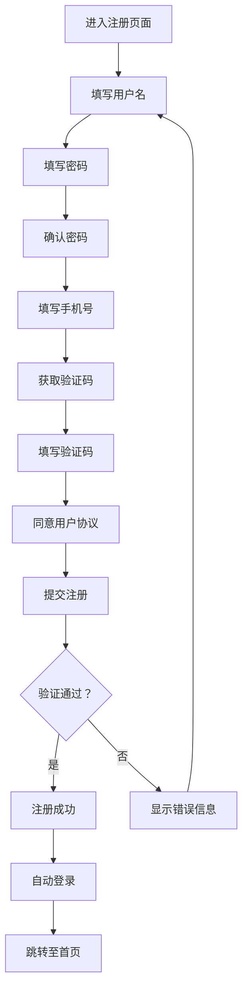
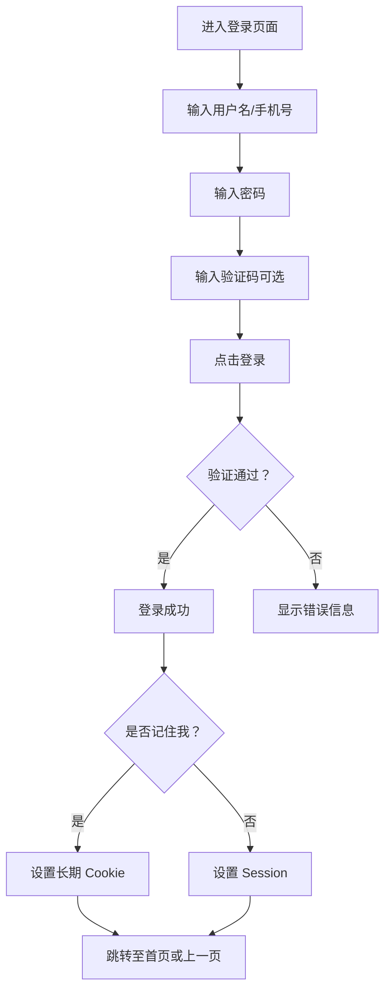
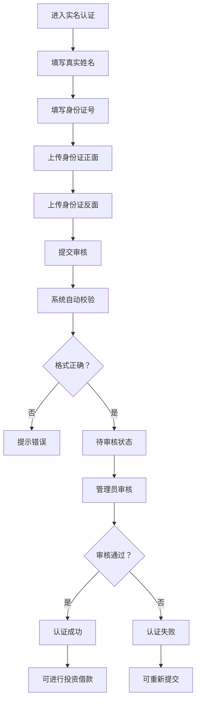
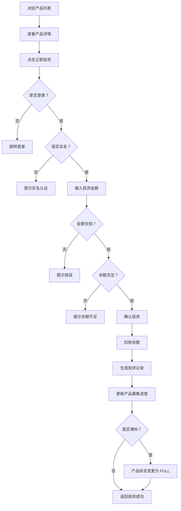
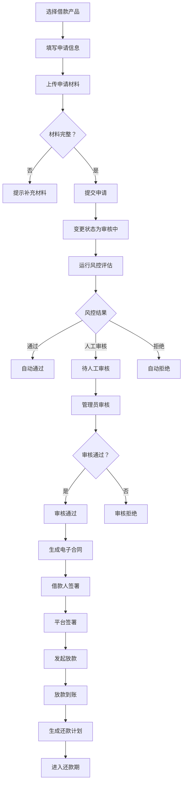
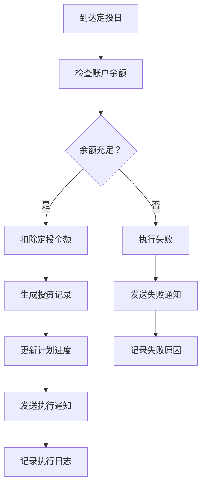

# WeFinance 智能金融平台 - 详细需求文档

**文档版本**: v1.0  
**编制日期**: 2026 年 3 月 22 日  
**项目名称**: WeFinance 智能金融服务平台  
**文档状态**: 正式版  

---

## 目录

1. [项目概述](#1-项目概述)
2. [用户角色与权限](#2-用户角色与权限)
3. [核心业务模块](#3-核心业务模块)
4. [功能需求详细说明](#4-功能需求详细说明)
5. [数据模型设计](#5-数据模型设计)
6. [接口需求](#6-接口需求)
7. [安全需求](#7-安全需求)
8. [性能需求](#8-性能需求)
9. [部署与运维](#9-部署与运维)
10. [附录](#10-附录)

---

## 1. 项目概述

### 1.1 项目背景

WeFinance 是一个基于 Django 开发的现代化金融科技平台，旨在为用户提供一站式的财富管理解决方案。平台整合了 P2P 借贷、智能投资、财富规划、投资社区等多个核心业务模块，通过 AI 算法为用户提供个性化的投资建议和理财方案。

### 1.2 项目定位

- **目标用户**: 个人投资者、借款人、理财需求者
- **核心价值**: 智能、安全、便捷、透明
- **业务范围**: 投资理财、借款服务、智能投顾、财富管理、社区互动

### 1.3 技术栈

#### 后端技术
| 技术 | 版本 | 说明 |
|------|------|------|
| Python | 3.12+ | 核心编程语言 |
| Django | 5.2.6 | Web框架 |
| SQLite3 | - | 默认数据库（开发/演示环境） |
| Daphne | 4.0 | ASGI 服务器（支持 WebSocket） |
| Channels | 4.0 | WebSocket 实时通信 |
| Celery | 5.3 | 异步任务处理 |
| Django REST Framework | 3.14.0 | API 开发 |

#### 前端技术
| 技术 | 版本 | 说明 |
|------|------|------|
| Bootstrap | 5.3 | UI框架 |
| jQuery | 3.6 | JavaScript 库 |
| Chart.js | 4.4 | 数据可视化 |
| Font Awesome | 6.4 | 图标库 |
| CKEditor | 5.x | 富文本编辑器 |

### 1.4 系统架构

```
┌─────────────────────────────────────────────┐
│             用户层 (User Layer)              │
│  投资者 │ 借款人 │ 管理员 │ 客服人员          │
└─────────────────────────────────────────────┘
                    ↓
┌─────────────────────────────────────────────┐
│           表现层 (Presentation Layer)         │
│   Web 界面 │ 移动端 H5 │ API 接口              │
└─────────────────────────────────────────────┘
                    ↓
┌─────────────────────────────────────────────┐
│          业务逻辑层 (Business Layer)          │
│ 账户 │ 投资 │ 借款 │ 投顾 │ 财富 │ 社区 │ 客服 │
└─────────────────────────────────────────────┘
                    ↓
┌─────────────────────────────────────────────┐
│           数据访问层 (Data Access Layer)      │
│         ORM │ 缓存 │ 消息队列                 │
└─────────────────────────────────────────────┘
                    ↓
┌─────────────────────────────────────────────┐
│           基础设施层 (Infrastructure)         │
│    数据库 │ 文件存储 │ 日志 │ 监控            │
└─────────────────────────────────────────────┘
```

---

## 2. 用户角色与权限

### 2.1 用户角色定义

#### 2.1.1 游客 (Visitor)
- **定义**: 未注册或未登录的用户
- **权限**:
  - 浏览首页、产品介绍、新闻资讯
  - 查看公开的投资社区内容
  - 注册账号

#### 2.1.2 普通用户 (Individual User)
- **定义**: 已注册但未实名认证的用户
- **权限**:
  - 拥有游客所有权限
  - 完善个人资料
  - 绑定银行卡
  - 进行实名认证
  - **限制**: 无法进行投资、借款等核心业务操作

#### 2.1.3 认证用户 (Verified User)
- **定义**: 已完成实名认证的用户
- **权限**:
  - 拥有普通用户所有权限
  - 进行投资操作
  - 申请借款
  - 参与社区互动
  - 使用智能投顾服务
  - 制定财富计划

#### 2.1.4 VIP 用户 (VIP User)
- **定义**: 达到一定条件或付费升级为 VIP 的认证用户
- **权限**:
  - 拥有认证用户所有权限
  - 更高的借款额度（提升 50%）
  - 专属理财产品
  - 优先客服服务
  - 费率优惠

#### 2.1.5 客服人员 (Customer Service)
- **定义**: 负责在线客服咨询的工作人员
- **权限**:
  - 拥有认证用户部分权限
  - 处理用户咨询会话
  - 查看用户问题历史
  - 发送系统通知

#### 2.1.6 管理员 (Administrator)
- **定义**: 平台运营管理人员
- **权限**:
  - 用户管理（审核、冻结、解封）
  - 产品管理（发布、上下架）
  - 内容管理（新闻、社区管理）
  - 财务管理（账单、收益审核）
  - 借款审核与放款
  - 系统配置

#### 2.1.7 超级管理员 (Super Admin)
- **定义**: 系统最高权限管理者
- **权限**:
  - 拥有所有权限
  - 管理员权限配置
  - 系统参数设置
  - 数据备份与恢复

### 2.2 权限矩阵

| 功能模块 | 游客 | 普通用户 | 认证用户 | VIP 用户 | 客服 | 管理员 | 超管 |
|---------|------|---------|---------|--------|------|--------|------|
| 浏览首页 | ✅ | ✅ | ✅ | ✅ | ✅ | ✅ | ✅ |
| 查看产品 | ✅ | ✅ | ✅ | ✅ | ✅ | ✅ | ✅ |
| 阅读新闻 | ✅ | ✅ | ✅ | ✅ | ✅ | ✅ | ✅ |
| 浏览社区 | ✅ | ✅ | ✅ | ✅ | ✅ | ✅ | ✅ |
| 注册登录 | ✅ | - | - | - | - | - | - |
| 完善资料 | ❌ | ✅ | ✅ | ✅ | ✅ | ✅ | ✅ |
| 实名认证 | ❌ | ✅ | - | - | - | - | - |
| 绑定银行卡 | ❌ | ✅ | ✅ | ✅ | ✅ | ✅ | ✅ |
| 投资理财 | ❌ | ❌ | ✅ | ✅ | ❌ | ❌ | ❌ |
| 申请借款 | ❌ | ❌ | ✅ | ✅ | ❌ | ❌ | ❌ |
| 发布帖子 | ❌ | ❌ | ✅ | ✅ | ✅ | ✅ | ✅ |
| 智能投顾 | ❌ | ❌ | ✅ | ✅ | ❌ | ❌ | ❌ |
| 财富计划 | ❌ | ❌ | ✅ | ✅ | ❌ | ❌ | ❌ |
| 客服会话 | ❌ | ✅ | ✅ | ✅ | ✅ | ✅ | ✅ |
| 用户管理 | ❌ | ❌ | ❌ | ❌ | ❌ | ✅ | ✅ |
| 产品管理 | ❌ | ❌ | ❌ | ❌ | ❌ | ✅ | ✅ |
| 借款审核 | ❌ | ❌ | ❌ | ❌ | ❌ | ✅ | ✅ |
| 系统配置 | ❌ | ❌ | ❌ | ❌ | ❌ | ❌ | ✅ |

---

## 3. 核心业务模块

### 3.1 账户管理模块 (accounts)

#### 3.1.1 功能概述
负责用户全生命周期管理，包括注册、登录、认证、资料管理等。

#### 3.1.2 核心功能
1. **用户注册**
   - 用户名、密码、手机号验证
   - 邮箱验证（可选）
   - 自动发送欢迎消息

2. **用户登录**
   - 用户名/手机号 + 密码登录
   - 记住登录状态
   - 登录日志记录

3. **实名认证**
   - 身份证信息填写
   - 身份证正反面上传
   - OCR 识别（预留接口）
   - 人工审核流程
   - 审核结果通知

4. **个人资料管理**
   - 基本信息编辑（头像、性别、生日等）
   - 详细信息完善（学历、职业、收入等）
   - 联系信息更新

5. **银行卡管理**
   - 添加/删除银行卡
   - 设置默认银行卡
   - 银行卡验证

6. **账户安全**
   - 密码修改
   - 密码重置（邮箱验证码）
   - 登录日志查询
   - 账号注销

### 3.2 投资管理模块 (investments + products)

#### 3.2.1 功能概述
提供 P2P 借贷产品的浏览、投资、转让等功能。

#### 3.2.2 产品管理
1. **产品分类**
   - 信用贷
   - 车抵贷
   - 房抵贷

2. **产品状态流转**
   ```
   DRAFT → PENDING → APPROVED → RECRUITING → FULL → REPAYING → COMPLETED
   ```

3. **产品信息**
   - 借款金额、期限、年化利率
   - 还款方式（等额本息、先息后本、到期一次性还款）
   - 风险等级、担保方式
   - 募集进度、投资人数

#### 3.2.3 投资功能
1. **投资流程**
   - 产品详情查看
   - 投资金额输入（100 元起投，100 元整数倍）
   - 余额检查与扣除
   - 投资记录生成
   - 产品募集进度更新

2. **投资记录**
   - 投资编号自动生成
   - 预期收益计算
   - 实际收益追踪
   - 投资状态管理

3. **债权转让**
   - 转让订单创建
   - 转让价格设定
   - 转让进度跟踪
   - 转让明细记录

4. **收益管理**
   - 利息收益
   - 本金回收
   - 转让收益
   - 红包奖励
   - 推荐奖励

### 3.3 借款管理模块 (borrow)

#### 3.3.1 功能概述
提供借款申请、风控评估、合同签署、放款、还款等全流程服务。

#### 3.3.2 借款产品
1. **产品类型**
   - 信用贷：1 万 -5 万，年化 8%-15%
   - 车抵贷：5 万 -20 万，年化 10%-18%
   - 房抵贷：20 万 -50 万，年化 8%-12%

2. **借款期限**
   - 短期：1-6 个月
   - 中期：7-24 个月
   - 长期：25-36 个月

#### 3.3.3 借款申请流程
```
草稿 → 已提交 → 审核中 → 已通过/拒绝 → 已放款 → 还款中 → 已结清
```

1. **申请表单**
   - 基本信息：金额、期限、用途
   - 个人信息：职业、收入、工作年限
   - 联系信息：紧急联系人

2. **材料上传**
   - 身份证（正面、反面）
   - 收入证明（工资流水、其他收入）
   - 银行流水
   - 资产证明（房产证、行驶证等）
   - 工作证明（营业执照等）

3. **风控评估**
   - 自动风控规则引擎
   - 信用评分计算
   - 风险等级评定
   - 审批建议生成

4. **合同生成与签署**
   - 电子合同自动生成
   - 合同内容自定义
   - 电子签名
   - 合同文件下载

5. **放款管理**
   - 放款申请发起
   - 账户余额增加
   - 放款状态跟踪
   - 放款成功通知

6. **还款管理**
   - 还款计划自动生成
   - 主动还款
   - 代扣还款（预留）
   - 提前还款
   - 逾期还款处理
   - 展期申请

#### 3.3.4 信用评分系统
1. **评分维度**
   - 征信历史（40%）：借款记录、还款表现
   - 资产情况（20%）：资产证明、收入水平
   - 平台行为（20%）：活跃度、投资记录
   - 基础信息（20%）：资料完整度

2. **信用等级**
   - 低风险：≥700 分
   - 中风险：500-699 分
   - 高风险：<500 分

3. **提额任务**
   - 完善个人资料
   - 邀请好友注册
   - 持续投资
   - 按时还款
   - 上传资产证明

### 3.4 智能投顾模块 (roboadvisor)

#### 3.4.1 功能概述
基于 AI 算法为用户提供个性化的投资策略推荐。

#### 3.4.2 风险评估
1. **风险评估问卷**
   - 投资经验
   - 风险承受能力
   - 投资目标
   - 流动性需求

2. **风险等级划分**
   - 保守型（1-20 分）
   - 稳健型（21-40 分）
   - 平衡型（41-60 分）
   - 成长型（61-80 分）
   - 激进型（81-100 分）

#### 3.4.3 投资策略
1. **策略类型**
   - 稳赢债券计划（保守型）
   - 平衡增长计划（稳健型）
   - 激进增长计划（成长型）
   - 指数基金计划（平衡型）
   - 行业轮动计划（激进型）

2. **策略信息**
   - 预期年化收益率
   - 最大回撤
   - 波动率
   - 夏普比率
   - 管理费率

3. **策略持仓**
   - 资产配置比例（股票、债券、基金、ETF 等）
   - 权重分配
   - 定期 rebalance

#### 3.4.4 策略跟投
1. **用户策略**
   - 策略选择与购买
   - 投资金额设定
   - 持仓市值追踪
   - 累计收益计算

2. **业绩展示**
   - 单位净值
   - 日收益率
   - 累计收益率
   - 历史业绩曲线

### 3.5 财富管理模块 (wealth_plan)

#### 3.5.1 功能概述
帮助用户制定和执行财富增值计划。

#### 3.5.2 财富计划
1. **目标类型**
   - 购房计划
   - 购车计划
   - 教育计划
   - 养老计划
   - 旅行计划
   - 婚嫁计划
   - 应急基金
   - 自定义目标

2. **计划要素**
   - 目标金额
   - 当前金额
   - 目标年限
   - 每月目标
   - 完成进度

3. **计划模板**
   - 预设模板推荐
   - 模板参数配置
   - 一键创建计划

#### 3.5.3 定投功能
1. **自动投资**
   - 定投金额设定
   - 定投日期设置
   - 自动扣款执行
   - 执行日志记录

2. **投资记录**
   - 手动投资
   - 自动投资
   - 转入/提取
   - 投资收益

### 3.6 社区互动模块 (community)

#### 3.6.1 功能概述
提供投资交流、经验分享、问答互动的社区平台。

#### 3.6.2 论坛版块
1. **版块管理**
   - 版块分类
   - 版块描述与图标
   - 版块排序
   - 访问权限控制

2. **主题管理**
   - 主题发布与编辑
   - 富文本内容
   - 标签设置
   - 主题类型（普通、精华、公告、投票）
   - 查看数、回复数统计

3. **回复管理**
   - 楼层回复
   - 嵌套回复
   - 点赞功能
   - IP 地址记录

#### 3.6.3 用户互动
1. **收藏功能**
   - 收藏主题
   - 收藏文章
   - 收藏产品

2. **点赞功能**
   - 主题点赞
   - 回复点赞

3. **消息通知**
   - 系统通知
   - 交易提醒
   - 活动资讯
   - 回复通知
   - 点赞通知
   - 私信消息

### 3.7 客服系统 (customer_service)

#### 3.7.1 功能概述
基于 WebSocket 的实时在线客服系统。

#### 3.7.2 客服会话
1. **会话管理**
   - 用户发起会话
   - 客服分配会话
   - 会话状态跟踪（待处理、进行中、已关闭）
   - 会话历史记录

2. **消息通信**
   - 实时消息发送与接收
   - 消息类型（用户消息、客服消息、系统消息）
   - 消息已读状态
   - 聊天记录保存

3. **客服管理**
   - 客服人员分组
   - 会话分配策略
   - 服务质量统计

### 3.8 用户中心 (user_center)

#### 3.8.1 功能概述
为用户提供统一的个人中心入口。

#### 3.8.2 仪表盘
1. **资产概览**
   - 账户余额
   - 冻结余额
   - 总投资额
   - 总收益
   - 总资产

2. **统计数据**
   - 投资笔数
   - 借款笔数
   - 待收款金额
   - 待还款金额

3. **快捷操作**
   - 充值
   - 提现
   - 投资
   - 借款

#### 3.8.3 账单管理
1. **账单记录**
   - 收入账单（投资收益、利息收入、本金回收、转入、充值）
   - 支出账单（投资支出、借款还款、服务费、转出、提现）

2. **账单查询**
   - 按类型筛选
   - 按时间范围筛选
   - 按状态筛选
   - 分页展示

3. **账单统计**
   - 收入支出趋势图
   - 分类占比图

#### 3.8.4 安全设置
1. **登录密码管理**
2. **手机号绑定**
3. **邮箱绑定**
4. **登录设备管理**

### 3.9 新闻资讯模块 (news)

#### 3.9.1 功能概述
提供财经新闻、市场动态、行业资讯等内容。

#### 3.9.2 新闻管理
1. **新闻分类**
   - 宏观经济
   - 金融市场
   - 投资理财
   - 政策法规
   - 行业动态

2. **新闻内容**
   - 标题、摘要
   - 富文本正文
   - 封面图片
   - 标签
   - 来源作者

3. **新闻展示**
   - 列表页
   - 详情页
   - 推荐阅读
   - 热门排行

### 3.10 管理后台 (admin_panel)

#### 3.10.1 功能概述
为管理员提供统一的后台管理界面。

#### 3.10.2 用户管理
1. **用户列表**
   - 用户搜索与筛选
   - 用户详情查看
   - 用户状态管理（正常/冻结）
   - 用户资料编辑

2. **实名认证审核**
   - 待审核列表
   - 身份证照片查看
   - 审核通过/拒绝
   - 审核备注

3. **银行卡管理**
   - 银行卡列表
   - 银行卡启用/禁用

#### 3.10.3 产品管理
1. **产品发布**
   - 产品信息录入
   - 产品审核
   - 产品上下架

2. **产品监控**
   - 募集进度监控
   - 投资人数统计
   - 产品状态变更

#### 3.10.4 借款管理
1. **借款申请审核**
   - 待审核列表
   - 申请材料查看
   - 风控评估结果
   - 审核决定（通过/拒绝）
   - 审核备注

2. **放款管理**
   - 待放款列表
   - 放款操作
   - 放款记录查询

3. **还款监控**
   - 还款计划查询
   - 逾期管理
   - 展期审核

#### 3.10.5 内容管理
1. **新闻管理**
   - 新闻发布
   - 新闻编辑
   - 新闻下架

2. **社区管理**
   - 主题管理（加精、置顶、删除）
   - 回复管理（删除违规回复）
   - 用户禁言

3. **轮播图管理**
   - 轮播图上传
   - 轮播图排序
   - 轮播图启用/禁用

#### 3.10.6 财务管理
1. **账单查询**
   - 全局账单列表
   - 账单详情查看

2. **收益记录**
   - 收益发放记录
   - 收益统计

3. **充值提现**
   - 充值记录
   - 提现审核

#### 3.10.7 系统管理
1. **管理员管理**
   - 管理员账号创建
   - 权限分配
   - 登录日志

2. **系统配置**
   - 参数设置
   - 邮件配置
   - 风控规则配置

---

## 4. 功能需求详细说明

### 4.1 用户注册与登录

#### 4.1.1 注册流程


#### 4.1.2 登录流程


#### 4.1.3 密码找回
1. **忘记密码**
   - 输入注册邮箱
   - 发送验证码邮件
   - 输入验证码
   - 设置新密码
   - 密码重置成功

2. **验证码规则**
   - 4 位数字
   - 有效期 30 分钟
   - 单次有效
   - 每小时最多发送 5 次

### 4.2 实名认证流程

#### 4.2.1 认证流程


#### 4.2.2 审核规则
1. **自动校验**
   - 身份证号格式验证
   - 姓名长度验证
   - 图片格式验证（JPG/PNG）
   - 图片大小限制（≤5MB）

2. **人工审核**
   - 照片清晰度
   - 信息一致性
   - 真实性判断
   - 审核时限：24 小时内

### 4.3 投资流程

#### 4.3.1 投资操作流程


#### 4.3.2 投资规则
1. **起投金额**: 100 元
2. **递增金额**: 100 元的整数倍
3. **最大投资**: 不超过剩余募集额度
4. **投资时间**: 募集期内
5. **撤销规则**: 投资确认后不可撤销

### 4.4 借款申请流程

#### 4.4.1 申请流程图


#### 4.4.2 材料上传规则
1. **必须材料**
   - 身份证正面
   - 身份证反面
   - 收入证明

2. **可选材料**
   - 银行流水
   - 资产证明
   - 工作证明

3. **文件格式**
   - 图片：JPG、PNG
   - 文档：PDF
   - 大小：≤5MB

### 4.5 风控评估流程

#### 4.5.1 评估规则引擎
1. **规则类型**
   - 基础规则：年龄、职业等
   - 征信规则：信用记录、逾期次数
   - 收入规则：收入水平、负债比
   - 债务规则：现有负债、月供比
   - 行为规则：平台活跃度
   - 黑名单规则：欺诈记录

2. **规则结构**
   - 字段名：如 `debt_to_income_ratio`
   - 操作符：gt(大于)、lt(小于)、eq(等于) 等
   - 阈值：触发条件的数值
   - 分数影响：加分或扣分
   - 拒绝规则：是否一票否决

3. **评估流程**
   - 获取申请数据
   - 加载激活的规则
   - 逐条应用规则
   - 计算总分
   - 确定评估结果
   - 生成审批建议

#### 4.5.2 评分计算
```
总分 = 基础分 (60) + 规则加分 - 规则扣分

征信评分 = 批准率 × 40 + 按时还款率 × 60 - 逾期惩罚
收入评分 = min(月收入 / 200, 100)
资产评分 = 基础分 + 资产证明加分
行为评分 = 平台活跃分 + 投资月数加分 - 频繁申请扣分
```

#### 4.5.3 评估结果
| 总分范围 | 结果 | 建议 | 风险等级 | 利率 |
|---------|------|------|---------|------|
| ≥80 | 通过 | 建议通过 | 低风险 | 12% |
| 60-79 | 人工审核 | 建议人工审核 | 中风险 | 15% |
| <60 | 拒绝 | 建议拒绝 | 高风险 | - |

### 4.6 还款计划生成

#### 4.6.1 等额本息计算公式
```
每月还款额 = [贷款本金 × 月利率 × (1+ 月利率)^还款月数] ÷ [(1+ 月利率)^还款月数 - 1]

其中：
- 月利率 = 年利率 ÷ 12
- 还款月数 = 借款期限（月）
```

#### 4.6.2 还款计划表
| 期数 | 应还日期 | 应还本金 | 应还利息 | 应还总额 | 状态 |
|------|---------|---------|---------|---------|------|
| 1 | 2026-04-01 | 8,333.33 | 1,000.00 | 9,333.33 | 待还款 |
| 2 | 2026-05-01 | 8,333.33 | 916.67 | 9,250.00 | 待还款 |
| ... | ... | ... | ... | ... | ... |
| 12 | 2027-03-01 | 8,333.33 | 83.33 | 9,166.66 | 待还款 |

#### 4.6.3 还款处理
1. **正常还款**
   - 用户主动还款
   - 系统代扣（预留）
   - 更新还款计划状态
   - 生成还款记录

2. **提前还款**
   - 申请提前还款
   - 计算剩余本金
   - 计算违约金（如有）
   - 一次性结清

3. **逾期还款**
   - 逾期天数计算
   - 滞纳金计算（每日 0.05%）
   - 催收通知
   - 信用记录影响

### 4.7 智能投顾流程

#### 4.7.1 风险评估问卷
1. **问卷题目示例**
   - 您的投资经验如何？
   - 您能接受的最大亏损是多少？
   - 您的投资目标是什么？
   - 您计划的投资期限是多久？

2. **评分规则**
   - 每题对应不同分值
   - 累加总分
   - 根据总分确定风险等级

#### 4.7.2 策略推荐算法
```
IF 风险等级 == '保守型' THEN
    推荐策略 = ['稳赢债券计划']
ELSE IF 风险等级 == '稳健型' THEN
    推荐策略 = ['平衡增长计划', '指数基金计划']
ELSE IF 风险等级 == '平衡型' THEN
    推荐策略 = ['平衡增长计划', '激进增长计划']
ELSE IF 风险等级 == '成长型' THEN
    推荐策略 = ['激进增长计划', '行业轮动计划']
ELSE IF 风险等级 == '激进型' THEN
    推荐策略 = ['行业轮动计划', '激进增长计划']
END IF
```

#### 4.7.3 跟投流程
1. **策略选择**
2. **风险揭示书签署**
3. **投资金额设定**
4. **支付方式选择**
5. **确认跟投**
6. **生成持仓记录**
7. **定期调仓**

### 4.8 财富计划定投

#### 4.8.1 定投设置
1. **定投计划**
   - 定投金额：≥100 元
   - 定投频率：每月
   - 定投日期：1-31 日
   - 扣款账户：默认银行卡

2. **执行时间**
   - 每月定投日当天执行
   - 执行时间：上午 10:00
   - 失败重试：3 次

#### 4.8.2 定投执行流程


### 4.9 客服会话流程

#### 4.9.1 用户发起会话
1. **进入客服页面**
2. **描述问题**
3. **发起会话**
4. **等待客服接入**
5. **实时聊天**
6. **结束会话**
7. **服务评价**

#### 4.9.2 客服分配策略
1. **轮询分配**: 按顺序分配给空闲客服
2. **技能分配**: 根据问题类型分配专业客服
3. **VIP 优先**: VIP 用户优先接入

### 4.10 消息通知系统

#### 4.10.1 通知类型
1. **系统通知**: 平台公告、系统维护
2. **交易提醒**: 投资成功、还款提醒
3. **活动资讯**: 优惠活动、新产品上线
4. **回复通知**: 帖子被回复
5. **点赞通知**: 内容被点赞
6. **私信消息**: 用户间私信

#### 4.10.2 通知渠道
1. **站内消息**: 消息中心
2. **邮件通知**: 重要通知
3. **短信通知**: 紧急提醒（预留）
4. **推送通知**: 移动端推送（预留）

---

## 5. 数据模型设计

### 5.1 用户系统

#### 5.1.1 User (用户表)
```python
class User(AbstractUser):
    # 基本信息
    username: CharField(3-20 字符，字母数字下划线)
    phone: PhoneNumberField(唯一)
    user_type: ChoiceField(个人/企业)
    avatar: ImageField(可选)
    gender: ChoiceField(男/女/未知)
    birth_date: DateField(可选)
    
    # 实名认证
    real_name: CharField
    id_number: CharField(唯一)
    id_front_image: ImageField
    id_back_image: ImageField
    verification_status: ChoiceField(未认证/待审核/已通过/已拒绝)
    is_verified: BooleanField
    verified_at: DateTimeField
    reviewer: ForeignKey(审核人)
    review_notes: TextField
    
    # 财务信息
    balance: DecimalField(账户余额)
    frozen_balance: DecimalField(冻结余额)
    total_investment: DecimalField(累计投资)
    total_earnings: DecimalField(累计收益)
    
    # VIP 信息
    is_vip: BooleanField
    vip_level: IntegerField
    
    # 风险评估
    risk_level: CharField
    risk_assessment_date: DateTimeField
    
    # 设置
    notification_email: BooleanField
    notification_sms: BooleanField
```

#### 5.1.2 BankCard (银行卡表)
```python
class BankCard:
    user: ForeignKey
    card_number: CharField(去空格)
    card_type: ChoiceField(储蓄卡/信用卡)
    bank_name: CharField
    cardholder_name: CharField
    is_default: BooleanField
    is_active: BooleanField
```

#### 5.1.3 UserProfile (用户资料表)
```python
class UserProfile:
    user: OneToOneField
    education: ChoiceField(学历)
    occupation: CharField(职业)
    company: CharField(公司)
    monthly_income: ChoiceField(收入区间)
    investment_experience: IntegerField(投资年限)
    emergency_contact_name: CharField
    emergency_contact_phone: PhoneNumberField
    emergency_contact_relation: CharField
```

#### 5.1.4 LoginLog (登录日志表)
```python
class LoginLog:
    user: ForeignKey
    ip_address: GenericIPAddressField
    user_agent: TextField
    login_time: DateTimeField
    is_successful: BooleanField
    failure_reason: CharField
```

### 5.2 投资系统

#### 5.2.1 LoanProduct (借款产品表)
```python
class LoanProduct:
    name: CharField(产品名称)
    category: ForeignKey(分类)
    borrower: ForeignKey(借款人)
    loan_application: OneToOneField(关联借款申请)
    
    # 财务信息
    loan_amount: DecimalField(借款金额)
    annual_rate: DecimalField(年化利率)
    duration_months: IntegerField(期限)
    min_investment: DecimalField(起投金额)
    max_investment: DecimalField(最高投资额)
    increment: DecimalField(投资递增)
    
    # 产品信息
    loan_type: ChoiceField(借款类型)
    repayment_method: ChoiceField(还款方式)
    risk_level: ChoiceField(风险等级)
    guarantee_type: ChoiceField(担保方式)
    
    # 状态信息
    status: ChoiceField(状态)
    raised_amount: DecimalField(已募集金额)
    investor_count: IntegerField(投资人数)
    view_count: IntegerField(浏览数)
    
    # 时间信息
    funding_start_date: DateTimeField
    funding_end_date: DateTimeField
    value_date: DateField(起息日)
    maturity_date: DateField(到期日)
```

#### 5.2.2 Investment (投资记录表)
```python
class Investment:
    investment_id: CharField(投资编号，自动生成)
    investor: ForeignKey(投资人)
    product: ForeignKey(产品)
    amount: DecimalField(投资金额)
    expected_return: DecimalField(预期收益)
    actual_return: DecimalField(实际收益)
    status: ChoiceField(状态)
    invest_time: DateTimeField
    confirm_time: DateTimeField
    value_date: DateField
    maturity_date: DateField
```

#### 5.2.3 TransferOrder (转让订单表)
```python
class TransferOrder:
    transfer_id: CharField(转让编号)
    investment: ForeignKey(原投资)
    transferor: ForeignKey(转让人)
    transfer_amount: DecimalField(转让金额)
    transfer_price: DecimalField(转让价格)
    transferred_amount: DecimalField(已转让金额)
    status: ChoiceField(状态)
    create_time: DateTimeField
    expire_time: DateTimeField
```

### 5.3 借款系统

#### 5.3.1 LoanApplication (借款申请表)
```python
class LoanApplication:
    application_no: CharField(申请编号，自动生成)
    user: ForeignKey(借款人)
    product: ForeignKey(借款产品)
    
    # 借款信息
    amount: DecimalField(借款金额)
    term: IntegerField(期限)
    purpose: ChoiceField(用途)
    purpose_detail: TextField(详细说明)
    
    # 个人信息
    profession: ChoiceField(职业)
    monthly_income: DecimalField(月收入)
    monthly_debt: DecimalField(月负债)
    company_name: CharField(工作单位)
    work_years: IntegerField(工作年限)
    
    # 联系信息
    contact_name: CharField(紧急联系人)
    contact_phone: CharField(联系人电话)
    contact_relation: CharField(关系)
    
    # 审批信息
    approved_amount: DecimalField(批准金额)
    approved_rate: DecimalField(批准利率)
    credit_score: IntegerField(信用评分)
    risk_level: CharField(风险等级)
    
    # 状态和时间
    status: ChoiceField(状态)
    submitted_at: DateTimeField
    reviewed_at: DateTimeField
    funded_at: DateTimeField
```

#### 5.3.2 LoanDocument (借款文档表)
```python
class LoanDocument:
    application: ForeignKey(借款申请)
    document_type: ChoiceField(文档类型)
    sub_type: CharField(子类型)
    file: FileField(文件)
    file_name: CharField(文件名)
    file_size: IntegerField(文件大小)
    status: ChoiceField(审核状态)
    review_notes: TextField(审核备注)
    is_required: BooleanField(是否必须)
```

#### 5.3.3 RiskAssessment (风控评估表)
```python
class RiskAssessment:
    application: OneToOneField(借款申请)
    assessment_id: UUIDField(评估 ID)
    result: ChoiceField(通过/人工审核/拒绝)
    total_score: IntegerField(总分)
    risk_score: DecimalField(风险分数)
    
    # 各维度评分
    credit_score: IntegerField(征信评分)
    income_score: IntegerField(收入评分)
    asset_score: IntegerField(资产评分)
    behavior_score: IntegerField(行为评分)
    
    # 评估详情
    triggered_rules: JSONField(触发的规则)
    risk_factors: JSONField(风险因素)
    approval_suggestion: TextField(审批建议)
```

#### 5.3.4 LoanContract (借款合同表)
```python
class LoanContract:
    application: OneToOneField(借款申请)
    contract_no: CharField(合同编号)
    contract_content: TextField(合同内容)
    contract_template: CharField(合同模板)
    status: ChoiceField(生成中/待签约/已签约/已取消)
    generated_at: DateTimeField
    borrower_signed_at: DateTimeField(借款人签约时间)
    lender_signed_at: DateTimeField(出借人签约时间)
    borrower_signature: TextField(借款人签名)
    borrower_ip: GenericIPAddressField(签名 IP)
    contract_file: FileField(合同文件)
```

#### 5.3.5 RepaymentPlan (还款计划表)
```python
class RepaymentPlan:
    application: ForeignKey(借款申请)
    period: IntegerField(期数)
    due_date: DateField(到期日期)
    principal: DecimalField(应还本金)
    interest: DecimalField(应还利息)
    total_amount: DecimalField(应还总额)
    
    # 已还金额
    paid_principal: DecimalField
    paid_interest: DecimalField
    paid_amount: DecimalField
    
    status: ChoiceField(待还款/已还款/逾期/部分还款)
    paid_at: DateTimeField
    overdue_days: IntegerField(逾期天数)
    late_fee: DecimalField(滞纳金)
```

### 5.4 智能投顾系统

#### 5.4.1 RiskAssessment (风险评估表)
```python
class RiskAssessment:
    user: ForeignKey(用户)
    risk_level: ChoiceField(风险等级)
    risk_score: IntegerField(风险评分 1-100)
    answers: JSONField(问卷答案)
    assessment_date: DateTimeField(评估时间)
    is_current: BooleanField(是否当前有效)
```

#### 5.4.2 InvestmentStrategy (投资策略表)
```python
class InvestmentStrategy:
    name: CharField(策略名称)
    strategy_type: ChoiceField(策略类型)
    risk_level: ChoiceField(适合风险等级)
    description: TextField(策略描述)
    investment_philosophy: TextField(投资理念)
    target_audience: TextField(适合人群)
    
    # 收益信息
    expected_annual_return: DecimalField(预期年化收益)
    max_drawdown: DecimalField(最大回撤)
    volatility: DecimalField(波动率)
    sharpe_ratio: DecimalField(夏普比率)
    
    # 费率信息
    management_fee: DecimalField(管理费率)
    subscription_fee: DecimalField(申购费率)
    redemption_fee: DecimalField(赎回费率)
    
    # 投资限制
    min_investment: DecimalField(最小投资)
    max_investment: DecimalField(最大投资)
    
    is_active: BooleanField
    is_recommended: BooleanField
```

### 5.5 财富管理系统

#### 5.5.1 WealthPlan (财富计划表)
```python
class WealthPlan:
    plan_id: CharField(计划编号，自动生成)
    user: ForeignKey(用户)
    goal_type: ChoiceField(目标类型)
    category: ForeignKey(目标分类)
    plan_name: CharField(计划名称)
    description: TextField(计划描述)
    
    # 财务信息
    target_amount: DecimalField(目标金额)
    current_amount: DecimalField(当前金额)
    monthly_target: DecimalField(每月目标)
    
    # 时间信息
    target_years: IntegerField(目标年限)
    start_date: DateField
    target_date: DateField
    
    # 状态信息
    status: ChoiceField(状态)
    
    # 定投设置
    auto_invest: BooleanField(自动投资)
    auto_invest_amount: DecimalField(定投金额)
    auto_invest_day: IntegerField(定投日)
```

### 5.6 社区系统

#### 5.6.1 Topic (论坛主题表)
```python
class Topic:
    title: CharField(主题标题)
    slug: SlugField(URL 别名，自动生成)
    category: ForeignKey(版块)
    author: ForeignKey(作者)
    content: RichTextField(富文本内容)
    tags: CharField(标签)
    
    # 状态信息
    status: ChoiceField(正常/锁定/隐藏/删除)
    topic_type: ChoiceField(普通/精华/公告/投票)
    
    # 统计信息
    view_count: IntegerField(查看数)
    reply_count: IntegerField(回复数)
    like_count: IntegerField(点赞数)
    
    # 时间信息
    created_at: DateTimeField
    updated_at: DateTimeField
    last_reply_at: DateTimeField
    last_reply_user: ForeignKey(最后回复用户)
```

#### 5.6.2 Post (论坛回复表)
```python
class Post:
    topic: ForeignKey(主题)
    author: ForeignKey(作者)
    parent: ForeignKey(父回复，用于嵌套回复)
    content: RichTextField(回复内容)
    status: ChoiceField(正常/隐藏/删除)
    like_count: IntegerField(点赞数)
    floor_number: IntegerField(楼层号)
    ip_address: GenericIPAddressField(IP 地址)
```

### 5.7 客服系统

#### 5.7.1 CustomerServiceSession (客服会话表)
```python
class CustomerServiceSession:
    user: ForeignKey(用户)
    support_agent: ForeignKey(客服人员)
    status: ChoiceField(待处理/进行中/已关闭)
    created_at: DateTimeField
    updated_at: DateTimeField
    last_message_at: DateTimeField(最后消息时间)
```

#### 5.7.2 CustomerServiceMessage (客服消息表)
```python
class CustomerServiceMessage:
    session: ForeignKey(会话)
    sender: ForeignKey(发送者)
    message_type: ChoiceField(用户/客服/系统)
    content: TextField(消息内容)
    timestamp: DateTimeField(发送时间)
    is_read: BooleanField(是否已读)
```

### 5.8 账单系统

#### 5.8.1 BillRecord (账单记录表)
```python
class BillRecord:
    user: ForeignKey(用户)
    bill_type: ChoiceField(收入/支出)
    category: ChoiceField(分类)
    amount: DecimalField(金额)
    balance_after: DecimalField(交易后余额)
    description: CharField(描述)
    status: ChoiceField(处理中/已完成/失败/已取消)
    
    # 关联对象
    related_investment_id: IntegerField(关联投资 ID)
    related_loan_id: IntegerField(关联借款 ID)
    
    transaction_time: DateTimeField
```

---

## 6. 接口需求

### 6.1 API 设计规范

#### 6.1.1 RESTful 规范
- 使用 HTTP 方法表示操作：GET(查)、POST(增)、PUT(改)、DELETE(删)
- URL 使用复数名词：`/api/v1/products/`
- 响应格式统一为 JSON
- 使用标准 HTTP 状态码

#### 6.1.2 响应格式
```json
{
    "success": true,
    "message": "操作成功",
    "data": {
        // 具体数据
    },
    "error_code": null
}
```

#### 6.1.3 错误处理
```json
{
    "success": false,
    "message": "错误描述",
    "data": null,
    "error_code": "INVALID_PARAMETER"
}
```

### 6.2 核心 API 接口

#### 6.2.1 用户认证接口
1. **用户注册**: `POST /auth/api/register/`
2. **用户登录**: `POST /auth/api/login/`
3. **退出登录**: `POST /auth/api/logout/`
4. **密码重置**: `POST /auth/api/password/reset/`
5. **实名认证**: `POST /auth/api/verification/submit/`
6. **认证状态查询**: `GET /auth/api/verification/status/`

#### 6.2.2 投资接口
1. **产品列表**: `GET /investments/api/products/`
2. **产品详情**: `GET /investments/api/products/<id>/`
3. **创建投资**: `POST /investments/api/invest/`
4. **投资记录**: `GET /investments/api/my-investments/`
5. **转让订单**: `POST /investments/api/transfer/create/`
6. **受让投资**: `POST /investments/api/transfer/buy/`

#### 6.2.3 借款接口
1. **借款产品列表**: `GET /borrow/api/products/`
2. **创建申请**: `POST /borrow/api/application/create/`
3. **申请列表**: `GET /borrow/api/applications/`
4. **申请详情**: `GET /borrow/api/applications/<id>/`
5. **材料上传**: `POST /borrow/api/documents/upload/`
6. **合同签署**: `POST /borrow/api/contract/sign/`
7. **还款计划**: `GET /borrow/api/repayment-plan/<application_id>/`
8. **主动还款**: `POST /borrow/api/repay/`

#### 6.2.4 智能投顾接口
1. **风险评估**: `POST /roboadvisor/api/assessment/`
2. **评估结果**: `GET /roboadvisor/api/assessment/result/`
3. **策略列表**: `GET /roboadvisor/api/strategies/`
4. **策略详情**: `GET /roboadvisor/api/strategies/<id>/`
5. **跟投策略**: `POST /roboadvisor/api/strategy/invest/`
6. **我的策略**: `GET /roboadvisor/api/my-strategies/`

#### 6.2.5 财富计划接口
1. **计划列表**: `GET /wealth-plan/api/plans/`
2. **创建计划**: `POST /wealth-plan/api/plan/create/`
3. **计划详情**: `GET /wealth-plan/api/plans/<id>/`
4. **计划投资**: `POST /wealth-plan/api/plan/invest/`
5. **设置定投**: `POST /wealth-plan/api/plan/auto-invest/`
6. **计划模板**: `GET /wealth-plan/api/templates/`

#### 6.2.6 社区接口
1. **版块列表**: `GET /community/api/categories/`
2. **主题列表**: `GET /community/api/topics/`
3. **发布主题**: `POST /community/api/topics/create/`
4. **主题详情**: `GET /community/api/topics/<slug>/`
5. **发布回复**: `POST /community/api/posts/create/`
6. **点赞主题**: `POST /community/api/topics/<id>/like/`
7. **收藏主题**: `POST /community/api/favorites/add/`

#### 6.2.7 用户中心接口
1. **仪表盘数据**: `GET /user/api/dashboard/`
2. **账单列表**: `GET /user/api/bills/`
3. **账单统计**: `GET /user/api/bills/statistics/`
4. **余额查询**: `GET /user/api/balance/`
5. **充值**: `POST /user/api/recharge/`
6. **提现**: `POST /user/api/withdraw/`

#### 6.2.8 客服接口
1. **发起会话**: `POST /customer-service/api/session/create/`
2. **发送消息**: `POST /customer-service/api/message/send/` (WebSocket)
3. **历史会话**: `GET /customer-service/api/sessions/`
4. **会话详情**: `GET /customer-service/api/sessions/<id>/`

### 6.3 WebSocket 接口

#### 6.3.1 客服聊天
- **连接 URL**: `ws://host/customer-service/ws/<session_id>/`
- **消息格式**:
```json
{
    "type": "message",
    "content": "消息内容",
    "sender_id": 123
}
```

#### 6.3.2 实时通知
- **连接 URL**: `ws://host/notifications/ws/`
- **通知类型**:
  - 交易通知
  - 系统通知
  - 客服消息

---

## 7. 安全需求

### 7.1 数据安全

#### 7.1.1 密码安全
- 使用 PBKDF2 算法加密存储
- 密码长度要求：8-20 位
- 密码复杂度要求：包含字母和数字
- 禁止使用常见弱密码

#### 7.1.2 敏感信息加密
- 身份证号加密存储
- 银行卡号脱敏显示
- 手机号中间四位隐藏
- 传输过程使用 HTTPS 加密

#### 7.1.3 数据备份
- 数据库每日自动备份
- 备份文件异地存储
- 支持数据恢复演练

### 7.2 接口安全

#### 7.2.1 认证机制
- Session 认证 + CSRF Token
- Token 认证（API 使用）
- JWT 令牌（预留）

#### 7.2.2 权限控制
- 基于角色的访问控制 (RBAC)
- 接口级别权限验证
- 数据级别权限隔离

#### 7.2.3 请求防护
- CSRF 防护
- XSS 过滤
- SQL 注入防护
- 请求频率限制

### 7.3 业务安全

#### 7.3.1 实名认证
- 身份证格式验证
- 人脸比对（预留接口）
- 人工审核机制

#### 7.3.2 交易安全
- 交易密码验证
- 大额交易短信确认
- 异常交易监控
- 交易限额控制

#### 7.3.3 风控安全
- 反欺诈检测
- 黑名单管理
- 多头借贷检测
- 关联交易监控

### 7.4 审计日志

#### 7.4.1 操作日志
- 用户登录日志
- 关键操作记录
- 管理员操作审计

#### 7.4.2 交易日志
- 投资交易记录
- 借款申请记录
- 资金流水记录

#### 7.4.3 系统日志
- 错误日志
- 性能日志
- 安全事件日志

---

## 8. 性能需求

### 8.1 响应时间

#### 8.1.1 Web 页面
- 首页加载：≤3 秒
- 列表页加载：≤2 秒
- 详情页加载：≤2 秒
- 表单提交：≤3 秒

#### 8.1.2 API 接口
- 简单查询：≤500ms
- 复杂查询：≤1 秒
- 写操作：≤1 秒
- 批量操作：≤3 秒

#### 8.1.3 WebSocket
- 消息延迟：≤200ms
- 连接建立：≤1 秒

### 8.2 并发能力

#### 8.2.1 并发用户数
- 同时在线用户：≥10,000
- 峰值并发：≥1,000

#### 8.2.2 交易量
- 投资交易：≥100 TPS
- 借款申请：≥50 TPS
- 支付交易：≥200 TPS

### 8.3 数据存储

#### 8.3.1 数据库
- 支持千万级数据量
- 支持水平扩展
- 读写分离（生产环境）

#### 8.3.2 缓存
- 热点数据缓存
- Session 数据缓存
- 查询结果缓存

#### 8.3.3 文件存储
- 图片 CDN 加速
- 大文件分片存储
- 文件访问鉴权

### 8.4 可用性

#### 8.4.1 系统可用性
- 可用性目标：99.9%
- 故障恢复时间：≤30 分钟
- 数据恢复点目标：≤5 分钟

#### 8.4.2 容灾备份
- 多机房部署（生产环境）
- 数据异地备份
- 故障自动切换

---

## 9. 部署与运维

### 9.1 部署架构

#### 9.1.1 开发环境
```
单机部署
├── Django 开发服务器/Daphne
├── SQLite 数据库
└── 本地文件存储
```

#### 9.1.2 测试环境
```
Docker 容器化部署
├── Web 容器 (Daphne/Gunicorn)
├── SQLite/PostgreSQL 数据库
├── Redis 缓存
└── 静态文件服务
```

#### 9.1.3 生产环境
```
分布式集群部署
├── Nginx 负载均衡
├── Web 服务器集群 (Gunicorn + Daphne)
├── PostgreSQL 主从复制
├── Redis 集群
├── Celery 异步任务
├── 对象存储 (OSS/S3)
└── CDN 加速
```

### 9.2 Docker 部署

#### 9.2.1 容器配置
```yaml
version: '3.8'
services:
  web:
    build: .
    ports:
      - "8000:8000"
    volumes:
      - ./media:/app/media
      - ./staticfiles:/app/staticfiles
    environment:
      - DEBUG=False
      - SECRET_KEY=<your-secret-key>
    depends_on:
      - db
  
  db:
    image: postgres:13
    environment:
      - POSTGRES_DB=wefinance
      - POSTGRES_USER=admin
      - POSTGRES_PASSWORD=<password>
    volumes:
      - postgres_data:/var/lib/postgresql/data
  
  redis:
    image: redis:6-alpine
    ports:
      - "6379:6379"
```

#### 9.2.2 开机自启
```bash
# systemd 服务配置
[Unit]
Description=WeFinance Web Service
After=network.target

[Service]
Type=simple
User=www-data
WorkingDirectory=/var/www/wefinance
ExecStart=/var/www/wefinance/venv/bin/daphne -b 0.0.0.0 -p 8000 wefinance.asgi:application
Restart=always

[Install]
WantedBy=multi-user.target
```

### 9.3 监控告警

#### 9.3.1 性能监控
- CPU 使用率
- 内存使用率
- 磁盘 IO
- 网络流量
- 数据库连接数

#### 9.3.2 业务监控
- 用户活跃度
- 交易量统计
- 接口响应时间
- 错误率统计

#### 9.3.3 告警方式
- 邮件告警
- 短信告警（预留）
- 钉钉/企业微信（预留）

### 9.4 日志管理

#### 9.4.1 日志级别
- DEBUG: 调试信息
- INFO: 一般信息
- WARNING: 警告信息
- ERROR: 错误信息
- CRITICAL: 严重错误

#### 9.4.2 日志收集
- 应用日志：Python logging
- 访问日志：Nginx/Apache
- 系统日志：syslog

#### 9.4.3 日志分析
- ELK Stack（Elasticsearch, Logstash, Kibana）
- 日志检索
- 日志可视化

---

## 10. 附录

### 10.1 术语表

| 术语 | 英文 | 解释 |
|------|------|------|
| P2P | Peer-to-Peer | 个人对个人的网络借贷 |
| ROI | Return on Investment | 投资回报率 |
| APR | Annual Percentage Rate | 年化利率 |
| 等额本息 | Equal Installments of Principal and Interest | 每月还款额相等的还款方式 |
| 先息后本 | Interest First, Principal Last | 先还利息，到期还本金 |
| 风控 | Risk Control | 风险控制 |
| 征信 | Credit Investigation | 信用记录调查 |
| 逾期 | Overdue | 超过约定还款日期 |
| 坏账 | Bad Debt | 无法收回的借款 |
| 资金池 | Capital Pool | 归集的资金总和 |
| 债权 | Creditor's Rights | 要求债务人偿还资金的权利 |
| 转让 | Transfer | 将债权转让给第三方 |
| 定投 | Fixed Investment | 定期定额投资 |
| 夏普比率 | Sharpe Ratio | 衡量投资组合风险调整后收益的指标 |
| 最大回撤 | Max Drawdown | 投资组合可能出现的最大亏损幅度 |

### 10.2 参考资料

1. Django 官方文档：https://docs.djangoproject.com/
2. Django REST Framework: https://www.django-rest-framework.org/
3. Bootstrap 文档：https://getbootstrap.com/docs/
4. Channels 文档：https://channels.readthedocs.io/
5. 网络借贷信息中介机构管理暂行办法
6. 关于规范整顿"现金贷"业务的通知

### 10.3 文档变更记录

| 版本 | 日期 | 修订人 | 修订内容 |
|------|------|--------|----------|
| v1.0 | 2026-03-22 | WeFinance 团队 | 初始版本 |

### 10.4 联系方式

- **技术支持**: support@wefinance.com
- **项目地址**: GitHub Repository
- **问题反馈**: Issues

---

**文档结束**
